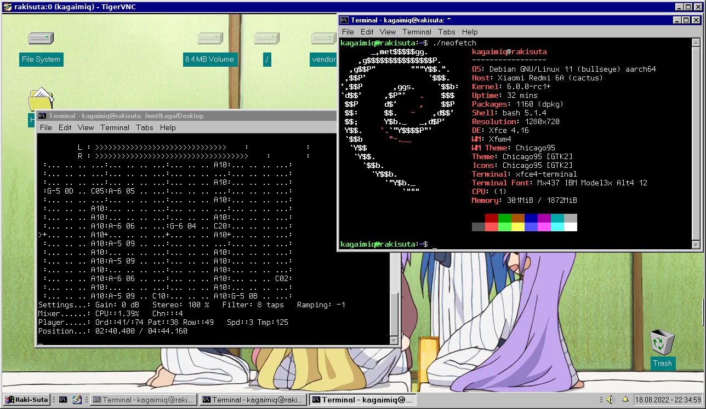

# mtkproto / mtkrunner

A tool that just loads and runs code on the MediaTek SoCs. Nothing more...
If you want to do something else, then take look at [mtkclient](https://github.com/bkerler/mtkclient) or similar.

To better understand why i ever need this, check out commit [c55c440dff](https://github.com/kagaimiq/mtkproto/tree/c55c440dff2c6d869d0aed4308d4068dc32b0630), and especially the "payload-mt6580-LinuxBoot" directory.

-------------------------------------------------------------------------------------------------------------

It doesn't bypass all the obstacles like the DAA/SLA or secure boot,
so if you have such a device, then first look [there](https://github.com/MTK-bypass),
or do it via mtkclient (run `./mtk payload`), or look at something else.

Right now it's in a state where it's better not to exist i guess...

First of all, it's written in C so it's quite a mess but most importantly,
only the POSIX serial API is supported and thus it works only on Linux, etc.
(being too lazy to copy the Win32 code from my MStar tool??)

Second, it is quite hardcoded, i mean, the part where the Download Agent's first stage runs.
I've just copied the DRAM init data from the preloader of Xiaomi Redmi 6A (preloader_cactus.bin),
and so there's quite few supported eMCP's..

Also to be noted is the fact that it supports *only* the new DA protocol (mtkclient calls it "XFlash"),
as the MT6765 DA uses this new protocol, while e.g. MT6580's DA uses older protocol.

The Reason is simple - MT6580 doesn't usually get locked down with all the protections and so its preloader
*does* appear as an "MT65xx Preloader" device on USB, which allows us to access DRAM without using any Download Agents.

Okay, enough ramblings and excuses, let's get to the `./mtkproto` anyway...

## Usage

`./mtkproto <mtk tty> [<payload addr> <payload file> [<payload 2 addr> <payload 2 file>]]`

- `<mtk tty>` - The port where the device resides, e.g. /dev/ttyACM0.
- `<payload addr>` - Address where the first payload is loaded
- `<payload file>` - File that will be loaded as the first payload
- `<payload 2 addr>` - Address where the second payload is loaded
- `<payload 2 file>` - File that will be loaded as the second payload

First thing it does after starting is it waits for the device on the port "`<mtk tty>`" indefinetly until it appears,
and it is able to open it.
Just hold a volume button (pull down KPCOL0 to GND) then plug in into USB, or wait for the preloader device, etc.

If no additional parameters specified (i.e. only the `<mtk tty>` is specified),
it just prints out some information it gets over USBDL (bootrom or preloader).

The first payload is loaded in the USBDL mode via commands `SEND_DA` and `JUMP_DA`.

Then the second payload is loaded in the DA "xflash" protocol, first sending out DRAM configs and other stuff first.

It's important to know that the DA's first stage (that we are executing now) expects to have its second stage
(that we are supposed to load) loaded, and so it checks the hash of what we have just loaded ("security check"),
and refuses to execute it if the hashes are different from what was hardcoded into stage1 binary itself.

And so i have included the "mtk_DA6765_nohashchecks.bin" file until i find a better solution.
What i've done is i ripped it off the "MTK_AllInOne_DA" and 'bypassed' the hash checks altogether.
Load address is 0x200000.

### Example

Run something from SRAM (but also can be used for DRAM when running off Preloader):

`./mtkproto /dev/ttyACM0 0x200000 payload.bin`

Run something from DRAM via Download Agent:

`./mtkproto /dev/ttyACM0 0x200000 mtk_DA6765_nohashcheck.bin 0x48000000 linux.bin`

--------

MTK Linux?? plays a module (yak-yak-yak.mod) and shows a neofetch...
